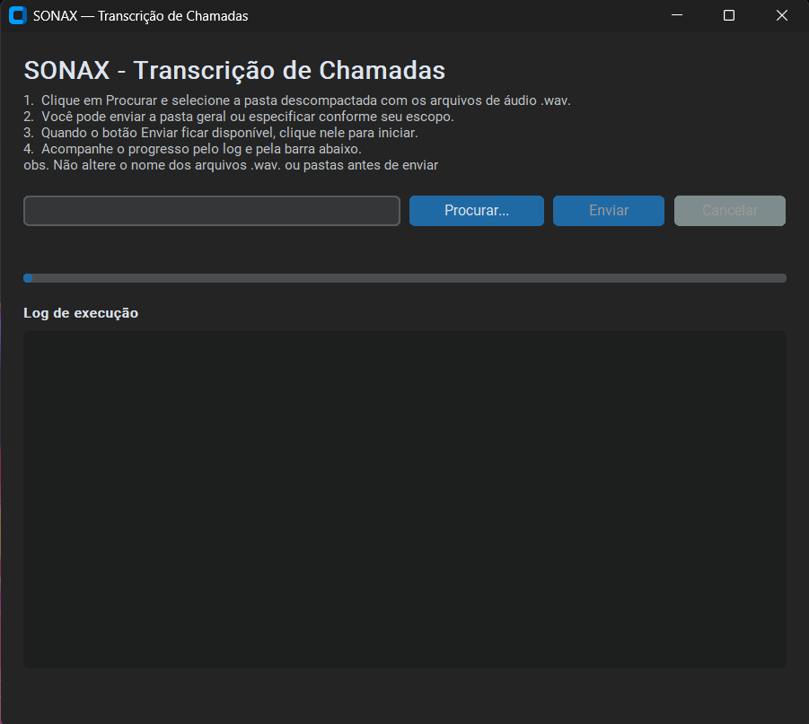
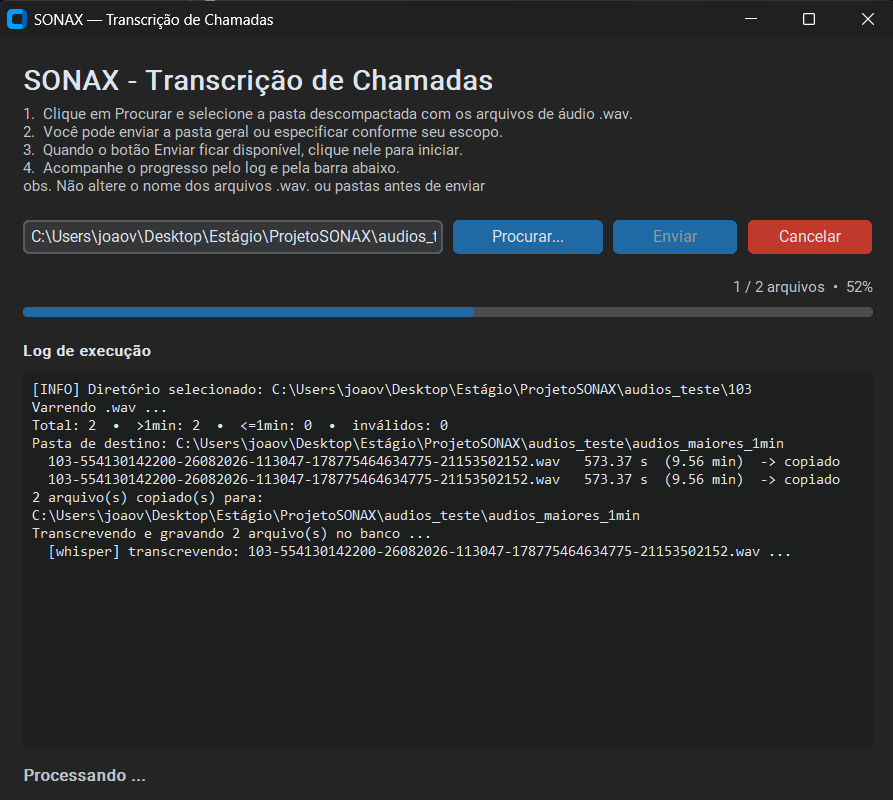

# 🎧 SONAX — Transcrição de Chamadas

Aplicação desktop desenvolvida em **Python**, com interface gráfica em **CustomTkinter**, que processa gravações de chamadas de um call center (`.wav`), transcreve os áudios elegíveis com **OpenAI Whisper** e grava os registros em um banco **PostgreSQL**, já vinculados ao atendente responsável pelo ramal no momento da ligação.

Este projeto está sendo desenvolvido durante o meu estágio na empresa **Falavinha Next**, como uma ferramenta interna para automatizar a transcrição e a organização das chamadas registradas pela central.

---

## 📸 Demonstração

### Tela inicial

Estado inicial da aplicação: o usuário seleciona a pasta descompactada (ou um `.zip`/`.rar`) com os áudios a processar.



### Processamento em andamento

Durante o processamento, o log de execução mostra cada etapa do pipeline em tempo real, junto com a barra de progresso cumulativa.



---

## ✨ Funcionalidades

- 📁 Seleção de uma pasta com os `.wav` ou de um arquivo compactado `.zip` / `.rar`
- 🔍 Varredura recursiva dos áudios, ignorando pastas temporárias e deduplicando arquivos com o mesmo nome
- ⏱️ Classificação automática por duração (elegíveis: >1min; descartados: ≤1min; inválidos: cabeçalho WAV corrompido)
- 📋 Cópia dos áudios elegíveis para uma pasta de trabalho (`audios_maiores_1min`)
- 🗣️ Transcrição em português via Whisper (modelo local, sem envio do áudio a serviços externos)
- 🧩 Parsing do nome do arquivo para extrair ramal, telefone, data, hora, timestamp e ID da chamada
- 👤 Resolução automática do atendente responsável pelo ramal, pela tabela `origem` (por período `dt_inicio`/`dt_fim`)
- 💾 Gravação de um registro por chamada em `registro_chamadas`, evitando duplicatas já processadas
- 📊 Barra de progresso cumulativa por fase (varredura → classificação → cópia → transcrição → gravação)
- ⛔ Cancelamento imediato durante a transcrição, mesmo no meio da inferência do Whisper
- 🗜️ Extração segura de `.zip`/`.rar`, com validação contra zip bomb e path traversal
- 🧹 Limpeza automática das pastas temporárias geradas ao final do processamento

---

## 🔄 Como funciona

A interface (`CustomTkinter`) roda o pipeline em uma **thread separada**, para não travar a GUI, e se comunica com a janela principal por meio de uma fila de eventos (`EventQueue`):

**Fluxo do pipeline (`app/view/worker.py`)**
1. **Extração** — se a entrada for `.zip`/`.rar`, descompacta antes de continuar.
2. **Varredura** — `coletar_wavs` percorre o diretório e lista os `.wav` únicos.
3. **Classificação** — `classificar_wavs` lê o cabeçalho RIFF/WAVE de cada arquivo (sem bibliotecas externas) e separa os áudios elegíveis (>1min).
4. **Cópia** — `copiar_longos_para_pasta` copia os elegíveis para a pasta de trabalho.
5. **Transcrição + gravação** — `salvar_no_banco` transcreve cada áudio com o Whisper, resolve o atendente pelo ramal/data e insere o registro no banco, um a um.
6. **Limpeza** — as pastas temporárias (extração e cópia) são removidas ao final.

**Threading e cancelamento**
Cada evento do pipeline (`LogEvent`, `ProgressEvent`, `DoneEvent`) é colocado na `EventQueue` e consumido pela GUI a cada 50ms (`after(50, self._poll)`), atualizando o log e a barra de progresso sem bloquear a interface. O botão **Cancelar** marca um `threading.Event` — respeitado entre arquivos — e também injeta uma exceção (`TranscricaoCancelada`) diretamente na thread do worker via `PyThreadState_SetAsyncExc`, interrompendo a inferência do Whisper em andamento sem esperar a próxima janela interna do `tqdm`.

**Camadas do projeto**
- `app/view` — GUI (CustomTkinter), worker thread, eventos e diálogos de seleção de arquivo/pasta
- `app/services` — lógica de domínio: leitura de WAV, classificação, parsing do nome do arquivo e transcrição
- `app/database` — configuração (`.env`) e conexão com o PostgreSQL (`psycopg`)

---

## 🛠️ Tecnologias utilizadas

| Tecnologia | Função |
|---|---|
| Python | Linguagem principal do projeto |
| CustomTkinter | Interface gráfica desktop |
| OpenAI Whisper | Transcrição de áudio em português (execução local) |
| PostgreSQL + psycopg | Persistência dos registros de chamada |
| python-dotenv | Configuração da conexão via `.env` |
| rarfile / zipfile | Extração de pastas de áudio compactadas (`.rar` / `.zip`) |
| tqdm | Hook de progresso interno da transcrição |

---

## 🗄️ Banco de dados

| Tabela | Descrição |
|---|---|
| `origem` | Histórico de qual atendente ocupou cada ramal, por período (`dt_inicio`/`dt_fim`) |
| `registro_chamadas` | Um registro por chamada transcrita: ramal, atendente, data/hora, nome do log (único) e transcrição |

> O script `copia_bd.sql` também reserva as tabelas `avaliacao_ia` e `avaliacao_criterio` para uma etapa futura de avaliação automática das chamadas por critérios (ex.: empatia, escuta ativa, eficiência), ainda não consumida pelo pipeline atual.

---

## 📂 Estrutura do projeto

```text
ProjetoSONAX/
│
├── run_gui.py                  # Atalho de inicialização da GUI
├── requirements.txt
├── copia_bd.sql                 # Script de criação do banco (Postgres)
│
└── app/
    ├── launcher.py               # Ajusta CWD/sys.path e delega para a view
    │
    ├── view/                      # Interface gráfica (CustomTkinter)
    │   ├── app.py                   # Janela principal
    │   ├── worker.py                 # Orquestra o pipeline em thread separada
    │   ├── events.py                  # EventQueue, LogEvent, ProgressEvent, DoneEvent
    │   ├── dialogs.py                  # Seleção de pasta / arquivo compactado
    │   └── stream.py                    # Redireciona prints para o log da GUI
    │
    ├── services/                  # Lógica de domínio
    │   ├── io.py                    # Varredura de .wav e resolução da pasta destino
    │   ├── script.py                  # Leitura do WAV, classificação, cópia, orquestração do INSERT
    │   ├── parses.py                    # Parsing de data/hora e do nome do arquivo
    │   ├── transcrever.py                # Transcrição via Whisper + cancelamento
    │   └── chamadas_dao.py                # Consultas e INSERTs em origem / registro_chamadas
    │
    └── database/                  # Conexão com o Postgres
        ├── config.py                 # Leitura do .env
        └── db.py                       # Context manager de conexão/transação
```

---

## ⚙️ Como executar

### 1. Clone o repositório e crie o ambiente virtual

```bash
git clone <url-do-repositorio>
cd ProjetoSONAX

python -m venv venv
```

Ative o ambiente virtual conforme o seu terminal:

```bash
.\venv\Scripts\Activate.ps1   # PowerShell
venv\Scripts\activate         # CMD
source venv/Scripts/activate  # Git Bash
```

### 2. Instale as dependências

```bash
pip install -r requirements.txt
```

### 3. Configure o banco de dados

Crie um banco PostgreSQL e rode a **Etapa 01** do script `copia_bd.sql` (tabelas `origem` e `registro_chamadas`).

### 4. Configure o `.env`

Crie um arquivo `.env` na raiz do projeto com as credenciais do banco:

```env
DB_USER=seu_usuario
DB_PASSWORD=sua_senha
DB_HOST=localhost
DB_PORT=5432
DB_NAME=nome_do_banco
```

### 5. Execute a aplicação

```bash
python run_gui.py
```

---

## 📌 Dependências

O projeto faz uso das seguintes bibliotecas (ver `requirements.txt`):

- `customtkinter` — interface gráfica
- `openai-whisper` — transcrição de áudio
- `psycopg` / `psycopg-binary` — driver PostgreSQL
- `python-dotenv` — leitura do `.env`
- `rarfile` — extração de arquivos `.rar` (requer WinRAR ou 7-Zip instalado no Windows, caso não estejam no PATH)
- `tqdm` — barra de progresso interna, usada como hook de cancelamento

---

## ⚠️ Observações

- Os nomes dos arquivos `.wav` **não devem ser alterados**: o parser depende do padrão `ramal-telefone-DDMMAAAA-HHMMSS-timestamp-callID.wav`.
- Chamadas cujo ramal não está registrado na tabela `origem` para a data/hora da ligação são puladas, com aviso no log.
- Arquivos já gravados no banco (mesmo nome de log) não são reprocessados.
- A transcrição roda localmente via Whisper — nenhum áudio é enviado a serviços externos.
- Extrair `.rar` no Windows requer WinRAR ou 7-Zip instalado, caso não estejam no PATH do sistema.

---

## 🎯 Objetivos do projeto

Este projeto foi desenvolvido durante o estágio na Falavinha Next, com o objetivo de:

- automatizar a transcrição e organização das chamadas registradas pela central telefônica;
- vincular automaticamente cada chamada ao atendente correto, considerando a movimentação de pessoas entre ramais ao longo do tempo;
- entregar uma ferramenta interna simples, com interface gráfica, utilizável por quem não tem familiaridade com linha de comando;
- praticar threading, comunicação segura entre thread de trabalho e GUI, e integração com um modelo de IA local (Whisper).

---

## 📚 Principais aprendizados

Durante o desenvolvimento deste projeto foi possível aprofundar conhecimentos em:

- Construção de interfaces gráficas desktop com CustomTkinter e comunicação thread-safe via fila de eventos;
- Cancelamento cooperativo **e** preemptivo de threads em Python (`threading.Event` + injeção de exceção assíncrona via `ctypes`);
- Leitura binária de cabeçalhos WAV (chunks RIFF/fmt/data) sem bibliotecas externas;
- Uso do Whisper para transcrição local em português, com hooks de progresso via `tqdm`;
- Modelagem de um banco relacional com vínculo temporal entre ramal e atendente;
- Extração segura de arquivos `.zip`/`.rar`, com validação contra zip bomb e path traversal;
- Organização de um projeto Python em camadas (view / services / database).

---

## 📄 Licença

Este projeto é uma ferramenta interna desenvolvida durante o estágio na empresa **Falavinha Next**, para uso da própria empresa.

---

## 🤖 Uso de inteligência artificial

O uso de inteligência artificial (Claude, via Claude Code) foi realizado para auxiliar no desenvolvimento do projeto, apoiando a arquitetura do pipeline, o tratamento de threading/cancelamento e a revisão de código. O código produzido foi revisado pelo desenvolvedor responsável.